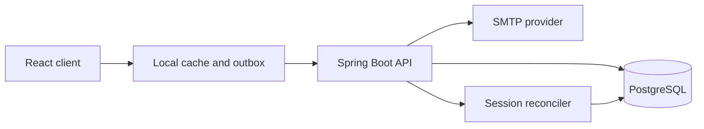

# Vesta backend architecture

The backend adds optional cloud continuity without removing the anonymous,
offline-first product. Architectural decisions live in `adr/`. The public API
is versioned under `/api/v1`; the generated OpenAPI document is available at
`/api-docs` and its initial design is stored in `docs/api/openapi.yaml`.

